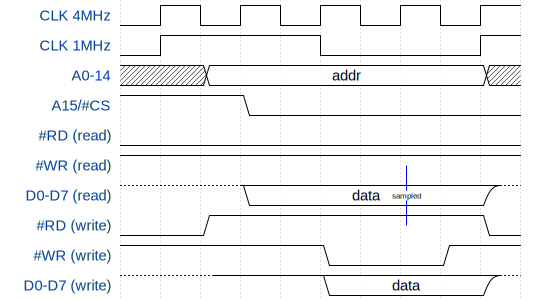

# Gameboy Hardware Information

The GB runs with a CPU of 2^22Hz (~4Mhz) and accesses the memory bus with a clock
frequency 4 times less (~1Mhz).
The GBC introduced a double-speed mode where both the CPU clock and the memory bus clock
run at twice the speed (~8Mhz and ~2MHz).

## Cartdrige Pins

TODO Table
The meaning of the PHI abrreviation is still unknow to me.

## Bus Timing

GB runs with a CPU of 2^22Hz (= appr. 4.19Mhz) and accesses the memory bus with a clock
frequency 4 times less (= appr. 1.05Mhz). The 1Mhz clock signal is available on the CLK
cartdrige pin. The following digital timing diagram based on information from
[Game Boy: Complete Technical Reference][gb-ctr] Appendix C and
[Game Boy Memory Access Patterns][iceboy-memaccess].

Internal pullup resistors define a stable state when neither the GB nor
the cardrige drive the data lines. The GB never drives the data lines (D0-D7) when the
#RD line is low.

[iceboy-memaccess]: http://iceboy.a-singer.de/doc/mem_patterns.html
[gb-ctr]: https://github.com/Gekkio/gb-ctr

# Implementation Notes

## Analysis Bus Signals

NOTE: The following discussion ignores the fact that RP2040 runs at 3.3V and the GB at 5V.

There are 26 usable GPIO pins on the RPI PICO board. Without any switchable buffer, level
shifter or other multiplexer chip we must use atleast 23 GPIOs for the address (A0-A14)
and data lines (D0-D7). This leaves us with three spare GPIOs for the five remaining
cartrigde lines: CLK, #CS, A15, #RD and #WR (ignoring the AUDIO_INT and RST signals which
are not used by any game).

Lets consider which information each signal carries and why some signals can be igonered:
| Signal | Information | Usage in Firmware |
|---|---|---|
| CLK | 1MHz bus/machine clock | Rising edge as trigger and reference for timing of other signals. |
| #CS | Goes low when the GB accesses cartridge RAM (0xA000-0xBFFF) and WRAM (0xC000-0xDFFF). | Select target memory: ROM when #CS high, #RAM when #CS low. |
| A15 | Goes low when the GB reads from cartridge ROM (0x0000-0x7FFF) or writes to MBC registers. | Ignored: A15 low is mutually exclusive to #CS low. When #CS is high the GB either accesses ROM or an internal bus. In case of internal bus access we still update data lines with ROM data but the GB will ignore that. |
| #RD | GB drives the data lines (D0-D7) when high. | Used to control the data output direction. |
| #WR | Goes low when data lines are valid. | Ignored: According to the bus timings diagram the falling edge of #WR is always aligned with the falling edge of CLK. Because the #WR only goes low while #RD is high the information it carries is fully redundant. |

It would even be possible to use A15 instead of CLK. In that case we would wait for A15
or #CS to go low before sampling the address lines.
The advantage of using CLK is that we can sample the address lines and #RD half cycle
earlier which gives us more time to fetch data from (slow) memory. It comes with the
downside that we also fetch from ROM and drive the data lines in idle cycles because
there to distinguish without A15.

## Reducing Pin usage with Transceiver Chips

RP2040 runs at 3.3V and the GB at 5V which means that some kind of level shifting is
required anyway. With chips like SN74ALVC164245 (2x 8bit  Level-Shifting Transceiver
With 3-State Outputs) it is easy to reduce the pin count by multiplexing the cartrdige
signals to a 8-bit wide input. In addition we now need four more OE (output enable) pins
to select the active transceiver and one DIR (select direction) to select between read
and write operation for the data lines.
This results in a total of 13 required GPIO pins on the PICO for the cartridge interface.

TODO: Example from schematic
